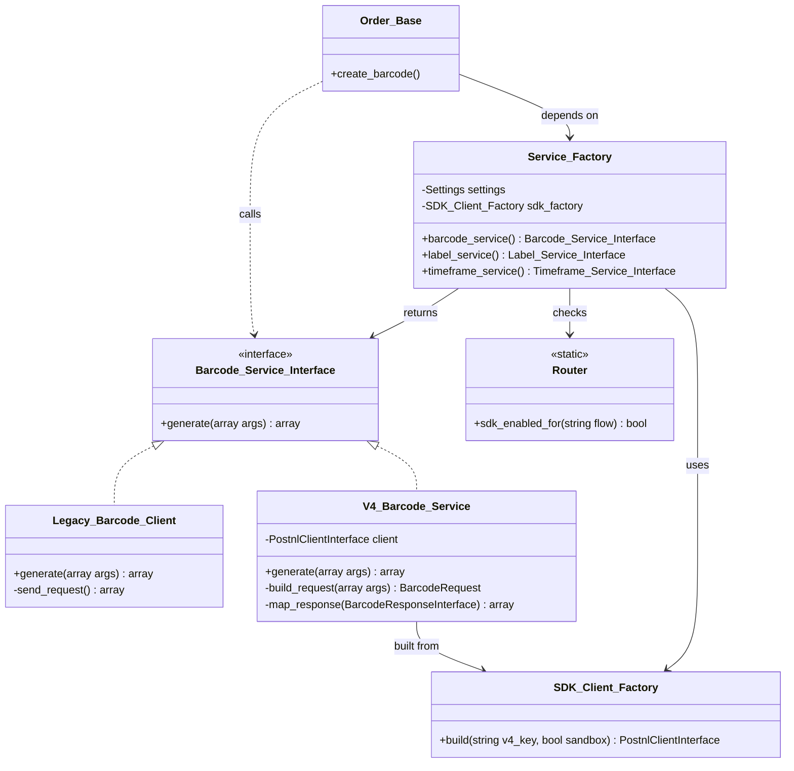
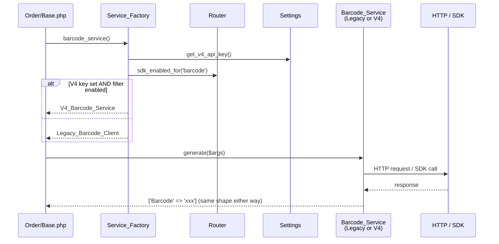

# Approach 2 — Architecture & Folder Structure

## Pattern

**Per-flow service interfaces with two implementations: `Legacy` (current V1 HTTP) and `V4` (new SDK).** A `Service_Factory` selects the implementation at runtime based on V4-key presence + per-flow `Router` filter. Callers depend only on the interfaces.

## Folder structure

```
src/Rest_API/
├── Contracts/                          (new — interface contracts)
│   ├── Barcode_Service_Interface.php
│   ├── Timeframe_Service_Interface.php
│   ├── Pickup_Location_Service_Interface.php
│   ├── Label_Service_Interface.php
│   ├── Return_Label_Service_Interface.php
│   ├── Postcode_Check_Service_Interface.php
│   └── Smart_Returns_Service_Interface.php
├── Legacy/                             (existing — moved + implements interfaces)
│   ├── Barcode/
│   │   ├── Client.php                  (existing class, now implements Barcode_Service_Interface)
│   │   └── Item_Info.php               (unchanged)
│   ├── Checkout/                       (existing combined timeframe+pickup; split at the interface layer)
│   ├── Shipping/
│   ├── Return_Label/
│   ├── Letterbox/
│   ├── Shipment_and_Return/
│   ├── Postcode_Check/
│   ├── Smart_Returns/
│   ├── Base.php                        (existing HTTP base; unchanged)
│   └── Base_Info.php                   (existing payload base; unchanged)
├── V4/                                 (new — SDK-backed implementations)
│   ├── Barcode/
│   │   ├── Service.php                 (implements Barcode_Service_Interface)
│   │   └── Request_Builder.php         (maps plugin args → BarcodeRequest DTO)
│   ├── Timeframe/
│   ├── Pickup_Location/
│   ├── Label/
│   ├── Return_Label/
│   ├── Postcode_Check/                 (uses V1 PostalCodeCheckExtension — SDK exposes nothing newer)
│   └── Smart_Returns/
├── SDK/                                (new — SDK wiring)
│   ├── Client_Factory.php              (builds PostnlClientInterface from settings)
│   ├── Logger_Adapter.php              (WC_Logger → PSR-3)
│   ├── Cache_Adapter.php               (WP transients → PSR-16)
│   └── Exception_Converter.php         (SDK exceptions → plugin error shape)
├── Service_Factory.php                 (new — chooses Legacy vs V4 per flow)
└── Router.php                          (new — per-flow filter gating)

src/Helper/
└── Product_Mapper/                     (new — Phase 0.1)
    ├── V1_Mapper.php                   (extracted from Mapping.php; same legacy codes)
    └── V4_Mapper.php                   (legacy options → ShipmentType + Services)
```

## Interface contracts

One example shown; all seven follow the same pattern (small surface, return-shape contract).

```php
namespace PostNLWooCommerce\Rest_API\Contracts;

interface Barcode_Service_Interface {

	/**
	 * Generate a single barcode for a shipment.
	 *
	 * @param array $args {
	 *     @type string $type             Barcode type, e.g. '3S', 'UE', 'LA', 'CD'.
	 *     @type string $range            Barcode range derived from type.
	 *     @type string $serie            Serie range, e.g. '000000000-999999999'.
	 *     @type string $customer_code    4-char customer code.
	 *     @type string $customer_number  Numeric customer number.
	 * }
	 *
	 * @return array { 'Barcode': string }
	 *
	 * @throws \PostNLWooCommerce\Exception\Service_Exception
	 */
	public function generate( array $args ): array;
}
```

Each interface defines:
- **Parameter shape** — what callers pass in (matches existing `Item_Info` output).
- **Return shape** — same array shape both Legacy and V4 produce, so callers (`Order/Base.php` etc.) don't branch.
- **Exception type** — both implementations throw the same `Service_Exception` (Legacy uses existing error handling; V4 uses the `Exception_Converter`).

## Class diagram



## Request flow (sequence)



## File-by-file change summary

| Existing file | Change | Phase |
|---|---|---|
| `src/Helper/Mapping.php` | Extract into `Helper/Product_Mapper/V1_Mapper.php`; add unit tests for all 72 combinations | 0.1 |
| `src/Rest_API/Barcode/Client.php` | Move to `Rest_API/Legacy/Barcode/Client.php`; `implements Barcode_Service_Interface` | 1.2 |
| `src/Rest_API/Checkout/Client.php` | Move to `Rest_API/Legacy/Checkout/Client.php`; split into two interface methods (timeframe + pickup) | 1.2 |
| `src/Rest_API/Shipping/Client.php` | Move to `Rest_API/Legacy/Shipping/Client.php`; `implements Label_Service_Interface` | 1.2 |
| `src/Rest_API/Return_Label/Client.php` | Move to `Rest_API/Legacy/Return_Label/Client.php`; `implements Return_Label_Service_Interface` | 1.2 |
| `src/Rest_API/Smart_Returns/Client.php` | Move to `Rest_API/Legacy/Smart_Returns/Client.php`; `implements Smart_Returns_Service_Interface` | 1.2 |
| `src/Rest_API/Postcode_Check/Client.php` | Move to `Rest_API/Legacy/Postcode_Check/Client.php`; `implements Postcode_Check_Service_Interface` | 1.2 |
| `src/Rest_API/Letterbox/Client.php` | Move to `Rest_API/Legacy/Letterbox/Client.php` (still extends Shipping) | 1.2 |
| `src/Rest_API/Shipment_and_Return/Client.php` | Move to `Rest_API/Legacy/Shipment_and_Return/Client.php` (still extends Shipping) | 1.2 |
| `src/Rest_API/Base.php` | Move to `Rest_API/Legacy/Base.php`; no behavioral change | 1.2 |
| `src/Rest_API/Base_Info.php` | Move to `Rest_API/Legacy/Base_Info.php`; no behavioral change | 1.2 |
| `src/Order/Base.php::create_barcode()` | Switch to `Service_Factory->barcode_service()->generate(...)` | 1.2 |
| `src/Order/Base.php::create_shipping_label()` | Switch to `Service_Factory->label_service()->create(...)` | 1.2 |
| `src/Order/Single.php` (AJAX handlers) | Inject `Service_Factory`; call interfaces instead of `new Client()` | 1.2 |
| `src/Checkout_Blocks/Extend_Block_Core.php` | Wire to timeframe + pickup services via factory (was single Checkout/Client call) | 2.4 |
| `src/Frontend/Container.php` | Same — call two services and compose | 2.4 |
| `src/Logger.php` | Unchanged — legacy paths still use `check_pdf_content()`. SDK path uses `Logger_Adapter` + SDK redaction. | — |
| `src/Shipping_Method/Settings.php` | V4-key fields added in separate PR (already in flight) | (other PR) |
| `composer.json` | `postnl/api-client-sdk` added (done) | — |

## What does NOT change

- Order metadata structure (`_postnl_order_metadata` shape, key names, barcode/label storage)
- Filters and actions (`postnl_shipment_addresses`, `postnl_order_weight`, etc.) — fired from both transports at the same callsite-equivalent point
- Frontend React components (`client/checkout/postnl-container/block.js` etc.) — they consume the same shape from REST endpoints
- Tracking URL generation
- Email templates and notifications
- Settings UI (other than the V4-key field added in the separate PR)
- Database schema
